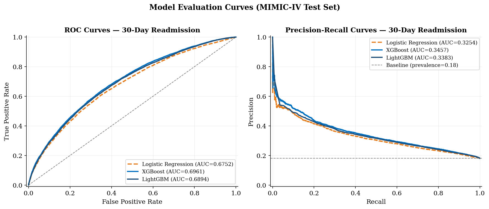

# 🏥 Explainable, Fair, and Observable Machine Learning for Hospital Readmission Prediction

<div align="center">


**Isaac Tosin Adisa** · Department of Statistics · Florida State University
`ita24@fsu.edu`

</div>

---

> *An integrated, explainable, and demographically fair machine learning framework for predicting 30-day hospital readmission risk — validated on 415,231 MIMIC-IV admissions with full SHAP explainability and a specified observability architecture.*

> All results reported in the accompanying manuscript are fully reproducible using this repository.

---

## 📌 Overview

Adoption of AI-based readmission prediction tools in clinical workflows remains limited despite decades of research. This project addresses the three main barriers to clinical translation:

| Barrier | This Project's Solution |
|---|---|
| 🔲 Black-box predictions | Per-patient SHAP waterfall explanations via LightGBM TreeExplainer |
| 🔲 No deployment reliability infrastructure | Well-defined observability architecture: Prometheus + Grafana + AKS + SLOs |
| 🔲 Inadequate fairness evaluation | Full demographic audit across 16 subgroups — no post-hoc fairness adjustment required |

### Alignment with U.S. National Policy
- ✅ **CMS Hospital Readmissions Reduction Program (HRRP)** — aligned with HRRP objectives
- ✅ **White House EO on Safe & Trustworthy AI (Oct 2023)** — transparent, auditable clinical AI
- ✅ **ONC TEFCA** — FHIR-compatible API design for national health exchange integration

---

## 📊 Results



### Model Performance (MIMIC-IV Test Set, n = 62,285)

| Model | AUC-ROC (95% CI) | AUC-PRC | F1 | Recall | Brier Score |
|---|---|---|---|---|---|
| Logistic Regression | 0.675 (0.669–0.680) | 0.326 | 0.381 | 0.599 | 0.224 |
| **XGBoost** ⭐ | **0.696 (0.691–0.701)** | **0.346** | **0.394** | **0.641** | 0.217 |
| LightGBM | 0.689 (0.684–0.695) | 0.333 | 0.390 | 0.612 | **0.146** |
| LACE (reference) | 0.60–0.68 | — | — | — | — |

> ⭐ XGBoost achieves best discrimination, outperforming or matching the LACE clinical baseline (AUC 0.60–0.68). LightGBM achieves best calibration (Brier 0.146) and is the preferred model for real-time SHAP explanations.

### Top SHAP Features (LightGBM, mean |φ| across test set)

```
Prior Admissions (12 mo)   ████████████████████  0.085
Number of Medications      █████                 0.020
Number of Diagnoses        ████                  0.018
Length of Stay (days)      ████                  0.014
Number of Procedures       ███                   0.011
Age                        ██                    0.007
Charlson Comorbidity Index ██                    0.005
Emergency Admission        █                     0.003
```

### Fairness Evaluation (Zero post-processing required ✅)

| Demographic Dimension | Max ΔAUC | Max ΔFNR | Status |
|---|---|---|---|
| Race / Ethnicity | 0.011 | 0.034 | ✅ OK |
| Age Group | 0.012 | 0.016 | ✅ OK |
| Gender | 0.001 | 0.006 | ✅ OK |
| Insurance Type | 0.030 | 0.032 | ✅ OK |

All 16 subgroups pass equity thresholds (ΔAUC ≤ 0.05, ΔFNR ≤ 0.10) without threshold adjustment.

---

## 🚀 Quickstart

### 1. Clone & Install

```bash
git clone https://github.com/Tomisin92/readmission-prediction.git
cd readmission-prediction
pip install -r requirements.txt
```

### 2. Download MIMIC-IV

Access requires free credentialing via [PhysioNet](https://physionet.org/content/mimiciv/). Once approved:

```bash
# Place downloaded MIMIC-IV files under:
data/mimic-iv/
  ├── hosp/admissions.csv.gz
  ├── hosp/patients.csv.gz
  ├── hosp/diagnoses_icd.csv.gz
  ├── hosp/labevents.csv.gz
  └── hosp/prescriptions.csv.gz
```

### 3. Run the Full Pipeline

```bash
python run_all.py
```

This executes all 6 steps sequentially (~45–60 minutes depending on hardware):

```
Step 1/6  Data Acquisition & Cohort Building      ~37 min
Step 2/6  Feature Engineering & Train/Val/Test     ~22 sec
Step 3/6  Model Training (LogReg, XGBoost, LGBM)   ~5 min
Step 4/6  SHAP Explainability Analysis             ~79 sec
Step 5/6  Fairness & Equity Analysis               ~12 sec
Step 6/6  Paper Tables & Final Summary             ~24 sec
```

### 4. Run Individual Steps

```bash
python 01_data_acquisition.py
python 02_feature_engineering.py
python 03_train_models.py
python 04_shap_analysis.py
python 05_fairness_analysis.py
python 06_generate_paper_tables.py
```

---

## 🔁 Reproducibility

All experiments use fixed random seeds. Running the full pipeline reproduces all tables and figures reported in the manuscript.

---

## 🗂️ Project Structure

```
readmission-prediction/
│
├── run_all.py                        # Master pipeline runner
│
├── 01_data_acquisition.py            # Cohort building from MIMIC-IV
├── 02_feature_engineering.py         # Feature matrix + train/val/test split
├── 03_train_models.py                # LogReg, XGBoost, LightGBM + tuning
├── 04_shap_analysis.py               # SHAP TreeExplainer + figures
├── 05_fairness_analysis.py           # Subgroup equity evaluation
├── 06_generate_paper_tables.py       # LaTeX-ready tables + metrics JSON
│
├── data/
│   └── mimic-iv/                     # Raw MIMIC-IV (not tracked by git)
│
├── models/
│   ├── xgboost_model.pkl
│   ├── lightgbm_model.pkl
│   └── logistic_regression_model.pkl
│
├── outputs/
│   ├── figures/                      # All paper figures (PDF + PNG)
│   │   ├── shap_global_importance.*
│   │   ├── shap_beeswarm.*
│   │   ├── shap_waterfall.*
│   │   ├── roc_prc_curves.*
│   │   ├── fairness_auc_comparison.*
│   │   ├── fairness_fnr_comparison.*
│   │   ├── calibration_curves.*
│   │   └── threshold_analysis.*
│   └── metrics/
│       ├── paper_metrics.json
│       ├── cohort_table.csv
│       ├── performance_table.csv
│       ├── fairness_table.csv
│       └── shap_global_importance.csv
│
├── paper/
│   └── Adisa_2025_JBI_submission.tex # Full LaTeX manuscript (JBI submission)
│
└── requirements.txt
```

---

## 🏗️ Planned Deployment Architecture

The deployment architecture is specified as a conceptual and reproducible design for future implementation. Target architecture:

```
                        ┌─────────────────────────────────┐
                        │     Azure Kubernetes Service      │
                        │  ┌──────────┐  ┌─────────────┐  │
   EHR / FHIR  ──────▶  │  │ FastAPI  │  │  LightGBM   │  │
   Input Data           │  │ /predict │  │  + SHAP     │  │
                        │  │ /explain │  │ TreeExplainer│  │
                        │  └────┬─────┘  └─────────────┘  │
                        └───────┼─────────────────────────-┘
                                │
                    ┌───────────▼────────────┐
                    │  Prometheus + Grafana   │
                    │  SLO Monitoring         │
                    │  Drift Detection        │
                    └────────────────────────┘
```

**Target SLOs:**
- System availability: ≥ 99.9%
- p99 prediction latency: ≤ 200 ms
- p99 SHAP latency: ≤ 200 ms
- Error rate: ≤ 0.1%
- Prediction drift: ≤ 2σ from 30-day baseline

---

## 📦 Requirements

```
python>=3.9
pandas
numpy
scikit-learn
xgboost
lightgbm
shap
matplotlib
seaborn
hyperopt
imbalanced-learn
fastapi
uvicorn
prometheus-client
```

Install all:

```bash
pip install -r requirements.txt
```

---

## 📄 Citation

If you use this code or dataset pipeline, please cite:

```bibtex
@article{adisa2025readmission,
  title   = {An Integrated Framework for Explainable, Fair, and Observable
             Hospital Readmission Prediction: Development and Validation
             on MIMIC-IV},
  author  = {Adisa, Isaac Tosin},
  year    = {2025},
  note    = {Under review at Journal of Biomedical Informatics}
}
```

---

## 🔒 Data & Ethics

- **MIMIC-IV** data access requires credentialing via [PhysioNet](https://physionet.org). Raw data is **not included** in this repository.
- All analyses use de-identified data in compliance with the PhysioNet Data Use Agreement.
- The IRB of Florida State University waived ethical approval for this work.
- Fairness evaluation follows the equalized odds framework of [Hardt et al., NeurIPS 2016].

---

## 📜 License

This project is released under the [MIT License](LICENSE).

---

## 📬 Contact

**Isaac Tosin Adisa**
Department of Statistics, Florida State University
📧 ita24@fsu.edu

---

<div align="center">
<sub>Built with MIMIC-IV · XGBoost · LightGBM · SHAP · FastAPI · Prometheus · Grafana · Azure Kubernetes Service</sub>
</div>
